----
title:       "FHEM-Adapter"
lastChanged: "12.02.2019"
editLink:    "https://github.com/ioBroker/ioBroker.fhem/blob/master/docs/de/README.md"
---)

!>Achtung!   
Seite ist im Aufbau!  
    
# &emsp;FHEM-Adapter
Der FHEM-Adapter ermöglicht die einfache Einbindung eines oder auch mehrerer FHEM Servern in ein ioBroker-System.

Alle Module aus FHEM können eingelesen, über ioBroker gesteuert und zur Visualisierung verwendet werden.

Ebenso ist eine Sychronisation ausgewählter Objekte aus iobroker nach FHEM möglich

<!-- Einführungsbild-->
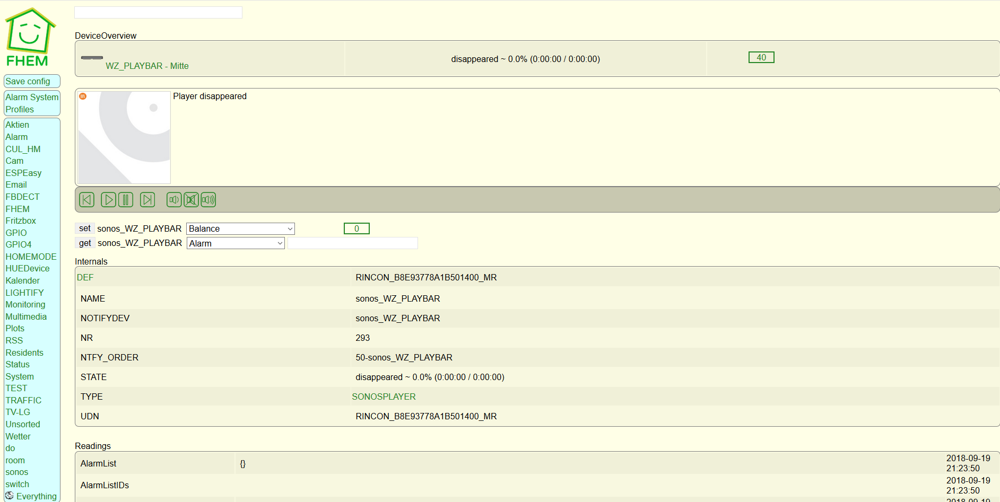   
*FHEM Oberfläche*

Inhaltsverzeichnis

| Navigation                          |
|-------------------------------------|
| 1  [Steckbrief](#steckbrief)        |  
| 2  [Überblick](#überblick)          |
| 3  [Installation](#installation)    |
| 4  [Konfiguration](#konfiguration)  |
| 5  [Instanz](#instanz)              |
| 6  [Objekte des Adapters](#objekte)           |
| 6.1 [Objekt HUEDevice1 (Bsp)](#objekte_c)  |
| 6.1.1 [Readings:state aus FHEM](#objekte_c_r)  |
| 6.1.2 [Attributes](#objekte_c_a)  |
| 6.1.3 [Internals](#objekte_c_i)  | 
| 6.1.4 [readingdGroup](#objekte_c_rg)  | 
| 6.2 [Objekte info](#objekte_i)      |
| 6.2.1 [Commands](#info_commands)      |
| 6.2.2 [Configurations](#info_configurations)      |
| 6.2.3 [Debug](#info_debug)      |
| 6.2.4 [Info](#info_info)      |
| 6.2.5 [Settings](#info_settings)      |
| 7  [Besonderheiten](#besonderheiten)|
| 7.1 [FHEM Raum ioB_System](#besonderheiten_fhem_ioB_System)|
| 7.2 [FHEM Raum ioB_IN](#besonderheiten_fhem_ioB_IN))|
| 7.3 [Übersicht Rollen](#besonderheiten_rollen)|
| 7.4 [Übersicht Funktionen](#besonderheiten_funktionen)|
| 8  [FAQ](#faq)                      |
| 9  [Beispiele](#beispiele)          |
| 9.1  [Adapter Material UI](#beispiele_material)          |
| 9.2  [Adapter VIS](#beispiele_vis)          |
| 10 [Deinstallation](#deinstallation)|
| 11 [Links](#links)                  |
| 12 [Historie](#historie)            |

<a name="steckbrief"/>

## 1 Steckbrief
> Achtung! Die folgende Tabelle dient nur als Beispiel. Sie wird vom
  Dokumentengenerator dynamisch erzeugt und an dieser Stelle eingefügt.
  Je nach den ausgewählten Feldern sind die Datenquellen z.B. `frontmatter`,
  `io-package.json` und `package.json` des jeweilgen Adapters.

|                         |                              |
|-------------------------|:----------------------------:|
| Stand der Doku          | {date:}                      |
| aktuelle Version stable | ![stable][logo]              |
| aktuelle Version latest | ![latest][logo]              |
| OS                      | unterstützte OS              |
| node-Version            | unterstützte node-Versionen  |
| Entwickler              | Name/Alias des Entwicklers   |
| Github                  | https://github.com/ioBroker/ioBroker.fhem                    |
| Lizenz                  | MIT                          |
| Kategorie               | Iot-Systeme           |
| Keywords                | `iobroker` `fhem` `smarthome`                |
| Abhängigkeiten          | `dependencies`               |      

<a name="überblick"/>

## 2 Überblick

### FHEM
FHEM bietet eine Vielzahl an Modulen mit diversen Protokollen.
Durch die Einbindung in ioBroker können alle FHEM Module in Verbindung mit sämtlichen ioBroker-Adaptern wie Alexa, VIS, Material usw genutzt werden.

### FHEM-Adapter
Nach erfolgreicher Verbindung zum FHEM Server werden für alle Module aus FHEM automatisch Objekte im ioBroker angelegt.
Nach der Synchronisation mit FHEM werden alle Zuständsänderungen von FHEM zum ioBroker übertragen.

Möglichkeiten zur Einschränkung der angelegten Objekte im ioBroker ist die Verwendung von definierten Räumen in FHEM oder blocken von einzelnen Modulen.

Durch die automatische Zuordnung von Rollen und Funktionen durch den Adapter werden viele Module aus FHEM (SONOSPLAYER, HUEDevice, Homematic usw) auch im Adapter `Material UI` erkannt und angezeigt.

Definierte Objekte aus ioBroker können auch nach FHEM übertragen werden.

<a name="voraussetzungen"/>

## Voraussetzungen vor der Installation
> Bei der Installation FHEM-Server wird ein telnet-Modul mit Namen `telnetPort` automatisch angelegt.
Ab FHEM 5.9 keine automatische Anlage von 'telnetPort'

Der FHEM Befehl `list telnetPort` sollte deshalb folgendes Ergebnis bringen:

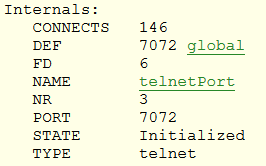  
*FHEM telnetPort*

Falls nicht vorhanden, mit FHEM Befehl `define telnetPort telnet 7072 global` anlegen.

> Zusätlich kann noch ein Passwort für die Telnet Verbindung gesetzt werden.

Der FHEM Befehl `list allowed_telnetPort` sollte folgendes Ergebnis bringen:

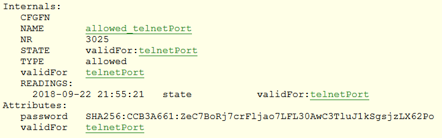  
*FHEM telnetPort Passwort*

Falls nicht vorhanden oder unvollständig, mit folgenden Befehlen anlegen/ergänzen/ändern: 

* `define allowed_telnetPort allowed` Anlage allowed-Modul mit Name allowed_telnetPort
* `attr allowed_telnetPort validFor telnetPort` Zuordnung telnet-Modul Name telnetPort
* `set allowed_telnetPort password <passwort>` Passwort setzen

> Zum Abschluß ist ein Test der Verbindung mit zB PuTTY zu empfehlen! (Download unter [Links](#links)) 

  
*Putty1*

  
*Putty Passwort*

* Eingabe Passwort und 2 * Return!

  
*Putty Prompt*

* `jsonlist2` FHEM Module
* `inform on` FHEM events 

<a name="installation"/>

## 3 Installation

> Eine Instanz des Adapters wird über die ioBroker Admin-Oberfläche installiert.
  Die ausführliche Anleitung für die dazu notwendigen Installatonschritte ist
  **hier** beschrieben.

<a name="konfiguration"/>

##  4 Konfiguration
Die Adapterkonfiguration beschränkt sich auf Angaben zum FHEM Server und Telnet Schnittstelle.

<a name="{Eindeutiger Fensterbezeichner}"/>

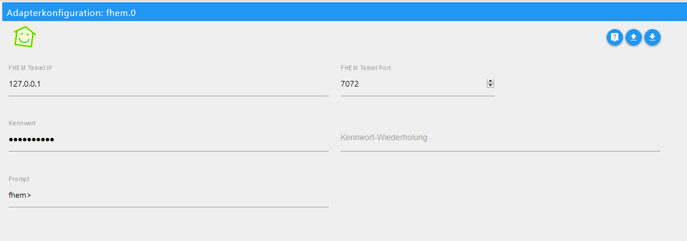  
*Adapterkonfiguration*

| Feld               | Beschreibung |                                                                       
|:-------------------|:-------------|
|**FHEM Telnet IP**|iobBroker/FHEM auf 1 Server (local)127.0.0.1, sonst IP FHEM Server                       |
|**FHEM Telnet Port**|Standard: 7072 oder Wert aus FHEM Modul telnetPort Internals:PORT              |                                                           
|**Kennwort**|Option: Wurde mit set allowed_telnetPort password `<passwort>` gesetzt                                                      |
|**Prompt**|Standard: fhem> oder Wert aus attr telnetPort prompt xxx + > oder Wert aus attr global title xxx + >        |

Alle Angaben beziehen sich auf bei der FHEM Installation automatisch angelegte Modul `telnetPort`

> Nach Abschluß der Konfiguration wird der Konfigurationsdialog mit
  `SPEICHERN UND SCHLIEßEN` verlassen. Dadurch efolgt im Anschluß ein
  Neustart des Adapters.

<a name="instanz"/>

##  5 Instanzen
> Die Installation des Adapters hat in der ioBroker Admin-Oberfläche Bereich `Instanzen` eine aktive Instanz des
  FHEM-Adapters angelegt.

  
*Erste Instanz*

Auf einem ioBroker Server können mehere Instanzen installiert werden.

> Ob der Adapter aktiviert oder mit FHEM verbunden ist,
  wird mit der Farbe des Status-Feldes der Instanz verdeutlicht. Zeigt der
  Mauszeiger auf das Symbol, werden weitere Detailinformationen dargestellt.

  
*Start Instanz fhem.o - ioBroker Admin-Oberfläche Bereich `Log`*

<a name="objekte"/>

## 6 Objekte des Adapters

> In der ioBroker Admin-Oberfläche Bereich `Objekte` werden in einer Baumstruktur alle vom Adapter in FHEM
  erkannten Gerätemodule und Hilfs (Erweiterungs-) Module alphabetisch aufgelistet.
  Falls im Modul das Attribut `alias` vorhanden ist wird es als `Name` des Objekts verwendet.
  Ist im Modul das Attribut `room` vorhanden wird es als `Raum` des Objekts verwendet.

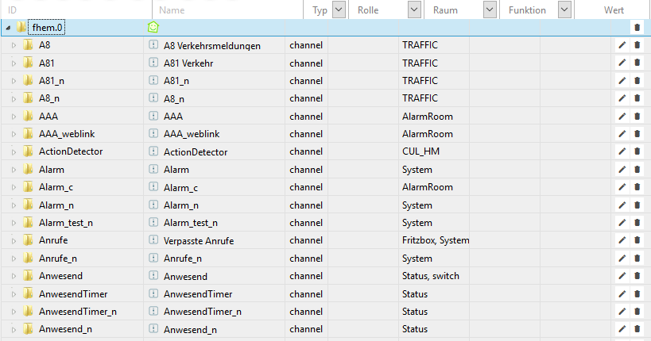  
*Übersicht Objekte*

> Die angelegten Objekte und ihre Bedeutungen sind wie folgt definiert:

Objekt                    | Zugriff | Bescheibung
:-------------------------|:-------:|:-----------
**fhem.0**                         |     | Name der ersten *Instanz* des FHEM Adapters
&emsp;**A8**                       |     | 1. Modul aus FHEM
&emsp;**A81**                      |     | 2. Modul aus FHEM
&emsp;**:**                        |     | x. Modul aus FHEM
&emsp;**[HUEDevice1](#objekte_c)** |     | HUEDevice1 (Beispiel)
&emsp;**[info](#objekte_i)**       |     | Information und mehr

<a name="objekte_c"/>

### 6.1 Objekt HUEDevice1 (Beispiel)
> Öffnet man ein Modul (channel), so erhält man eine Liste mit allen zum Modul gehörenden Funktionalitäten

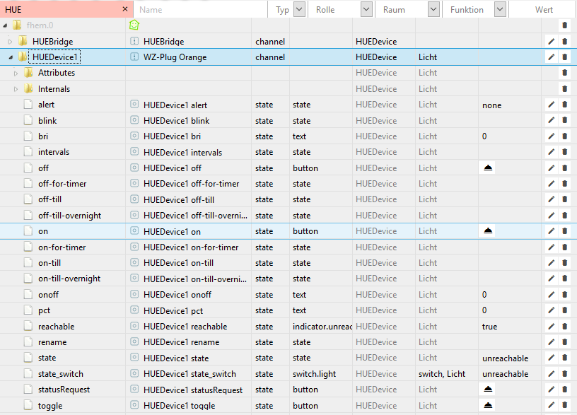  
*Übersicht Objekte-Modul*

> Die angelegten Objekte und ihre Bedeutungen sind wie folgt definiert:

Objekt                    | Zugriff | Bescheibung
:-------------------------|:-------:|:-----------
**[fhem.o](#objekte)**                     |     | Name der ersten *Instanz* des FHEM Adapters
&emsp;**HUEDevice1**                       |     | HUEDevice1 (Beispiel)
&emsp;&emsp;**[Attributes](#objekte_c_a)** |     | Mögliche Attribute: alias, room, comment
&emsp;&emsp;**[Internals](#objekte_c_i)**  |     | Mögliche Internals: NAME, TYPE
&emsp;&emsp;**alert**                      |  RW | 
&emsp;&emsp;**blink**                      |  RW | 
&emsp;&emsp;**:**                          |  R  | 
&emsp;&emsp;**:**                          |  RW | 

> Einem Objekt state ist immer eine Rolle zugeordnet. **[Übersicht Rollen](#besonderheiten_rollen)** **[Übersicht Funktionen](#besonderheiten_funktionen)** 

<a name="objekte_c_r"/>

#### 6.1.1 Readings:state aus FHEM

> Das Reading state hat in FHEM unterschiedliche Zustände/Funktionen. Bei Bedarf werden deshalb weitere Objekte:state in Abhängigkeit von state FHEM automatisch hinzugefügt. Diese zusätzliche Objekte:state werden jedoch nicht in FHEM angelegt. Eine Zustandsänderung von fhem.x.Device.state oder fhem.x.Device.state_switch wird an FHEM übertragen.

Objekt                        | Zugriff | Bescheibung | Wert
:-----------------------------|:-------:|:------------|:---:
fhem.x.Device.state           |   RW    | Wert aus FHEM 1:1 | text
fhem.x.Device.state_switch    |   RW    | if fhem.x.Device.state = on/off oder PossibleSets on und off vorhanden.   | true/false
fhem.x.Device.state_boolean   |   R     | if fhem.x.Device.state = open/opened/close/closed/present/absent/motion/nomotion | treu/false 
fhem.x.Device.state_value     |   R     | Abhängigkeit von fhem.x.Device.state_boolean | 0,2
fhem.x.Device.state_media     |   R     | Für Media Player            | 0,1

<a name="objekte_c_a"/>

#### 6.1.2 Attributes
> Attributes werden aus FHEM ausgelesen und können über ioBroker auch geändert werden.
In der Default Einstellung werden falls vorhanden `alias,comment,room` synchronisiert.
Ist `alias` nicht vorhanden wird automatisch fhem.x.Device.Attributes.alias mit Wert Internals:NAME angelegt.
Jede Änderung an Atrributes wird an FHEM übertragen.
Unter `fhem.x.info.Configurations.allowedAttributes` können weitere Atrributes hinzugefügt werden.

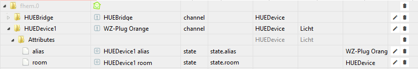  
*Objekte-Attributes*

> Die angelegten Objekte und ihre Bedeutungen sind wie folgt definiert:

Objekt                    | Zugriff | Bescheibung | Wert
:-------------------------|:-------:|:------------|:-----:
**[fhem.o](#objekte)**                     |     | Name der ersten *Instanz* des FHEM Adapters
&emsp;**[HUEDevice1](#objekte_c)**         |     | HUEDevice1 (Beispiel)
&emsp;&emsp;**Attributes**        |     | 
&emsp;&emsp;&emsp;**alias**       |  RW | alias = Name Objek:channel,bei Instanz fhem.0 SmartName für Adapter Cloud, Beschriftung Kachel Adapter Material UI + Übertrag in FHEM | text
&emsp;&emsp;&emsp;**comment**     |  RW | zur Info
&emsp;&emsp;&emsp;**room**        |  RW | room = Raum Objekt + Übertrag in FHEM | text

<a name="objekte_c_i"/>

#### 6.1.3 Internals
> Internals werden aus FHEM ausgelesen und sind nur als Info zB Anzeige in VIS gedacht.
In der Default Einstellung werden `TYPE,NAME`synchronisiert.
Unter `fhem.x.info.Configurations.allowedInternals` können weitere Internals hinzugefügt werden.

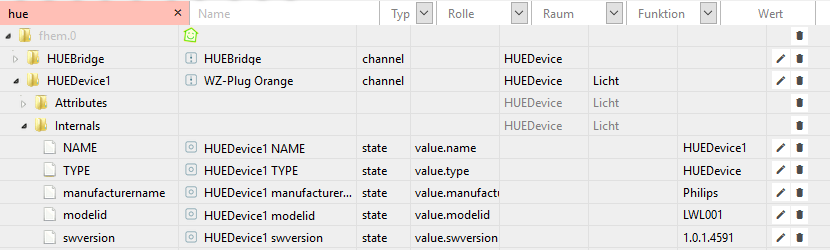  
*Objekte-Internals*

> Die angelegten Objekte und ihre Bedeutungen sind wie folgt definiert:

Objekt                    | Zugriff | Bescheibung
:-------------------------|:-------:|:-----------
**[fhem.o](#objekte)**                      |     | Name der ersten *Instanz* des FHEM Adapters
&emsp;**[HUEDevice1](#objekte_c)**          |     | HUEDevice1 (Beispiel)
&emsp;&emsp;**[Attributes](#objekte_c_a)**  |     | Mögliche Attribute: alias, room, comment + info.Configurations.allowedAttributes
&emsp;&emsp;**Internals**               |     | Mögliche Internals: NAME, TYPE + info.Configurations.allowedInternals
&emsp;&emsp;&emsp;**NAME**              |  R  | Info zB zur Anzeige in VIS
&emsp;&emsp;&emsp;**TYPE**              |  R  | Info zB zur Anzeige in VIS

<a name="objekte_c_rg"/>

#### 6.1.4 readingsGroup
> readingsGroup's werden bei jeder Änderung aus FHEM übertragen und stehen als Objekt/State (html) zur Verfügung.
> Bei Start Adapter können Inhalte der ReadingsGroups nicht angelegt werden und wereden auch nicht automatisch gelöscht

Objekt                    | Zugriff | Bescheibung | Wert
:-------------------------|:-------:|:------------|:---------:
**[fhem.o](#objekte)**                      |     | Name der ersten *Instanz* des FHEM Adapters |
&emsp;**Räume**          |     | Übersicht Räume (Beispiel) |
&emsp;&emsp;**[Attributes](#objekte_c_a)**  |     | Mögliche Attribute: alias, room, comment + info.Configurations.allowedAttributes |
&emsp;&emsp;**[Internals](objekte_c_i)**   |     | Mögliche Internals: NAME, TYPE + info.Configurations.allowedInternals |
&emsp;&emsp;**readingsGroup**               |     | Definition unter Internals:DEF|
&emsp;&emsp;&emsp;**Wohnzimmer**            |  R  | Info zB zur Anzeige in VIS |`<html>off</html>`
&emsp;&emsp;&emsp;**Schlafzimmer**          |  R  | Info zB zur Anzeige in VIS |`<html>on</html>`
&emsp;&emsp;&emsp;**Küche**                 |  R  | Info zB zur Anzeige in VIS |`<html>off</html>`

<a name="objekte_i"/>

## 6.2 Objekte info
> Öffnet man das Objekt info, so erhält man eine Liste mit allen weiteren Funktionalitäten und Informationen. Es ist nicht möglich ein Modul mit dem Namen info aus FHEM zu übernehmen.

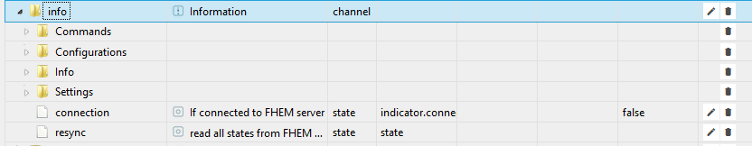  
*Objekt info*

> Die angelegten Objekte und ihre Bedeutungen sind wie folgt definiert:

Objekt                                                 | Zugriff | Bescheibung                                     | Werrt
:------------------------------------------------------|:-------:|:------------------------------------------------|:------:
**[fhem.o](#objekte)**                                 |     | Name der ersten *Instanz* des FHEM Adapters
&emsp;**info**                                         |     | Information und mehr
&emsp;&emsp;**[Commands](#info_commands)**             |     | Befehlszeile FHEM
&emsp;&emsp;**[Configurations](#info_configurations)** |     | 
&emsp;&emsp;**[Debug](#info_debug)**                   |     | Debug Modus
&emsp;&emsp;**[Info](#info_info)**                     |     | 
&emsp;&emsp;**[Settings](#info_settings)**             |     | Auswahl Einträge für Admin-Oberfläche Bereich `LOG`  
&emsp;&emsp;**connection**                             |  R  | Status Verbindung zu FHEM                            | true/false
&emsp;&emsp;**resync**                                 |  RW | Start Resync FHEM                                    | true/false

<a name="info_commands"/>

#### 6.2.1 Commands

> Unter Commands ist es möglich einen beliebigen Befehl an FHEM zu senden.

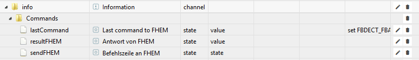  
*Objekt info - Commands*

> Die angelegten Objekte und ihre Bedeutungen sind wie folgt definiert:

Objekt                    | Zugriff | Bescheibung | Wert 
:-------------------------|:-------:|:------------|:----:
**[fhem.o](#objekte)**            |     | Name der ersten *Instanz* des FHEM Adapters
&emsp;**[info](#objekte_i)**      |     | Information und mehr
&emsp;&emsp;**Commands**          |     | Befehlszeile FHEM
&emsp;&emsp;&emsp;**lastCommand** |  R  | Letzer Befehl von ioBroker an FHEM | Zeichenkette
&emsp;&emsp;&emsp;**resultFHEM**  |  R  | Liefert Ergebnis von sendFHEM | Zeichenkette
&emsp;&emsp;&emsp;**sendFHEM**    |  RW | Entspricht Befehlszeile in FHEM zB update check | Zeichenkette

<a name="info_configurations"/>

#### 6.2.2 Configurations

> Unter Configurations können verschiedene Funktionen aktiviert/deaktiviert werden. Bei Änderungen wird ein Resync FHEM `fhem.x.info.resync` = true ausgeführt.

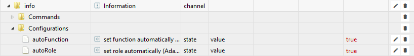  
*Objekt info - Configurations*

> Die angelegten Objekte und ihre Bedeutungen sind wie folgt definiert:

Objekt                                           | Zugriff | Bescheibung | Wert
:-------------------------------------------------|:---:|:-----------|:-------:
**[fhem.o](#objekte)**                            |     | Name der ersten *Instanz* des FHEM Adapters
&emsp;**[info](#objekte_i)**                      |     | Information und mehr
&emsp;&emsp;**[Commands](#info_commands)**        |     | Befehlszeile FHEM 
&emsp;&emsp;**Configurations**                    |     | Configurations
&emsp;&emsp;&emsp;**allowedAttributes**           |  RW | Sync Attributtes (default = `room,alias,comment`) | Attribut oder Attribut1,Attribut2 usw
&emsp;&emsp;&emsp;**allowedIOBin**                |  RW | Erlaubte Objekte zum Übertrag nach FHEM. Es wird auf die Zeichenkette am Anfang des Objects geprüft zb "alexa2.x.History" überträgt alle Objekte die mit alexa2.x.History beginnen. Objekte werden werden nach einer Änderung state in FHEM im Raum ioB_IN als Modul dummy angelegt.  | Wert oder Wert1,Wert2 usw
&emsp;&emsp;&emsp;**allowedInternals**            |  RW | Sync Internals (default = `TYPE,NAME`) | Internals oder Internals1,Internals2 usw
&emsp;&emsp;&emsp;**autoConfigFHEM**              |  RW | Erlaubt folgende Änderungen in FHEM 1.Für TYPE=SONOSPLAYER `attr xxx generateVolumeEvent 1` damit Lautstärke übertragen wird. 2. TYPE = HUEBridge 'attr xxx createGroupReadings 1' Readings für HUEGroup 3.Am Ende der Synchronisation `save` zum Speichern der Änderungen. (default=`false`) | true/false
&emsp;&emsp;&emsp;**autoFunction**                |  RW | Funktionen werden bei Neustart abhängig von Version FHEM Adaper vergeben (default=`false`) Für Adapter `Material UI`wird `true`empfohlen. Bei `false` können Funktionen selber vergeben werden und es erfolgt keine Änderung durch den Adapter | true/false
&emsp;&emsp;&emsp;**autoRole**                    |  RW | Rollen werden bei Neustart abhängig von Version FHEM Adaper vergeben  (default=`false`) Für Adapter `Material UI` wird `true`empfohlen. Bei `false` können Rollen selber vergeben werden und es erfolgt keine Änderung durch den Adapter. | true/false
&emsp;&emsp;&emsp;**autoSamrtName**               |  RW | Automatische Anlage Smart Geräte für Adapter Cloud (default=`true`) Nur Instanz fhem.0! | true/false
&emsp;&emsp;&emsp;**ignoreObjectsAttributesroom** |  RW | Kein Sync von Modulen mit Attributes:room | room oder room1,room2 usw
&emsp;&emsp;&emsp;**ignoreObjectsInternalsNAME**  |  RW | Kein Sync von Modulen mit Internals:NAME (default=`info`) | NAME oder NAME1,NAME2 usw
&emsp;&emsp;&emsp;**ignoreObjectsInternalsTYPE**  |  RW | Kein Sync von Modulen mit Internals:TYPE | TYPE oder TYPE1,TYPE2 usw
&emsp;&emsp;&emsp;**ignorePossibleSets**          |  RW | Kein Sync von PossibleSets (default=`getConfig,etRegRaw,gBulk,regSet,deviceMsg,CommandAccepted`)
&emsp;&emsp;&emsp;**ignoreReadings**              |  RW | Kein Sync von Readings (default=`currentTrackPositionSimulated, currentTrackPositionSimulatedSec`)
&emsp;&emsp;&emsp;**oldState**                    |  RW | state mit true/false (default=`false`) state als switch = state_switch| true/false
&emsp;&emsp;&emsp;**onlySyncNAME**                |  RW | Sync nur Module mit Internals:NAME | NAME oder NAME1,NAME2 usw
&emsp;&emsp;&emsp;**onlySyncRoom**                |  RW | Sync wenn Raum/Räume vorhanden nur Module aus Raum/Räume (default=`ioBroker,ioB_OUT`) | room oder room1,room2 usw

<a name="info_debug"/>

#### 6.2.3 Debug

> Unter Debug sind verschiedene Möglichkeiten zum Test.

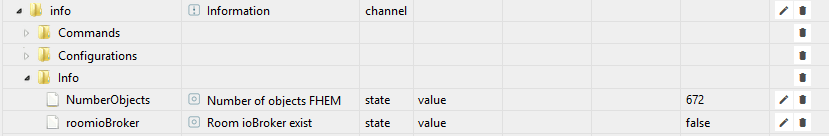  
*Objekt info - Info*

> Die angelegten Objekte und ihre Bedeutungen sind wie folgt definiert:

Objekt                    | Zugriff | Bescheibung | Wert
:-------------------------|:-------:|:------------|:----:
**[fhem.o](#objekte)**                                  |     | Name der ersten *Instanz* des FHEM Adapters
&emsp;**[info](#objekte_i)**                            |     | 
&emsp;&emsp;**[Commands](#info_commands)**              |     | Befehlszeile FHEM
&emsp;&emsp;**[Configurations](#info_configurations)**  |     | 
&emsp;&emsp;**Debug**                                   |     | Debug Modus
&emsp;&emsp;&emsp;**activate**                          |  RW | Name Device(s) aus FHEM durch Komma getrennt ->  Log [Devicename] im Admin Log | Text
&emsp;&emsp;&emsp;**jsonlist2**                         |  RW | jsonlist2 Device aus FHEM -> Test Synchro Device mit jsonlist2 aus FHEM| json
&emsp;&emsp;&emsp;**meta**                              |  RW | Name Device aus FHEM -> Test Synchro Device mit Name| Text

<a name="info_info"/>

#### 6.2.4 Info

> Unter Info sind verschiedene Parameter aus der Synchronisation sichtbar.

  
*Objekt info - Info*

> Die angelegten Objekte und ihre Bedeutungen sind wie folgt definiert:

Objekt                    | Zugriff | Bescheibung | Wert
:-------------------------|:-------:|:------------|:----:
**[fhem.o](#objekte)**                                  |     | Name der ersten *Instanz* des FHEM Adapters
&emsp;**[info](#objekte_i)**                            |     | 
&emsp;&emsp;**[Commands](#info_commands)**              |     | Befehlszeile FHEM
&emsp;&emsp;**[Configurations](#info_configurations)**  |     | 
&emsp;&emsp;**[Debug](#info_debug)**                    |     | Debug Modus
&emsp;&emsp;**Info**                                    |     | Info
&emsp;&emsp;&emsp;**buildDate**                         |  R  | Datum Version | 18.10.18
&emsp;&emsp;&emsp;**numberDevicesFHEM**                 |  R  | Anzahl Device(s) FHEM (jsonlist2) | Zahl
&emsp;&emsp;&emsp;**numberDevicesFHEMsync**             |  R  | Anzahl Device(s) FHEM synchronisiert | Zahl
&emsp;&emsp;&emsp;**numberObjectsIOBin**                |  R  | Anzahl Objekte aus FHEM | Zahl
&emsp;&emsp;&emsp;**numberObjectsIOBout**               |  R  | Anzahl Objekte zu FHEM übertragen | Zahl
&emsp;&emsp;&emsp;**numberObjectsIOBoutSub**            |  R  | Mögliche Anzahl Objekte zu FHEM aus fhem.x.info.Configurations.allowedIOBin | Zahl
&emsp;&emsp;&emsp;**roomioBroker**                      |  R  | Raum aus Configurations.onlySyncRoom vorhanden |true/false

<a name="info_settings"/>

#### 6.2.5 Settings

> Unter Settings können bestimmte Einträge für die ioBroker Admin-Oberfläche Bereich `Log` ausgewählt werden. Jede Änderung ist sofort wirksam.

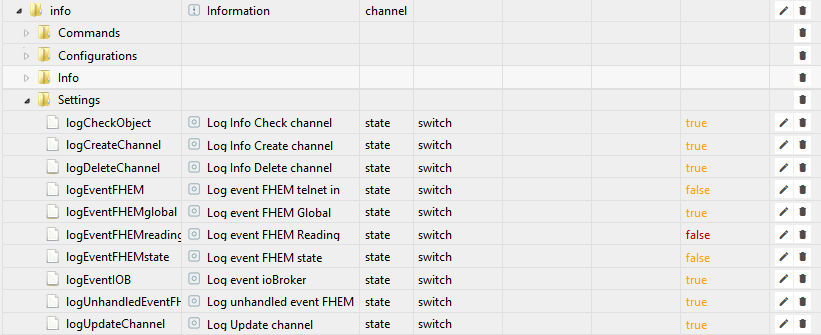  
*Objekt info - Settings*

> Die angelegten Objekte und ihre Bedeutungen sind wie folgt definiert: 

Objekt                    | Zugriff | Bescheibung | Wert
:-------------------------|:-------:|:------------|:-----:
**[fhem.0](#objekte)**                                 |     | Name der ersten *Instanz* des FHEM Adapters
&emsp;**[info](#objekte_i)**                           |     | Information und mehr
&emsp;&emsp;**[Commands](#info_commands)**             |     | Befehlszeile FHEM
&emsp;&emsp;**[Configurations](#info_configurations)** |     | 
&emsp;&emsp;**[Debug](#info_debug)**                   |     | Debug Modus
&emsp;&emsp;**[Info](#info_info)**                     |     | 
&emsp;&emsp;**Settings**                               |     | Einträge für Admin-Oberfläche Bereich `LOG`
&emsp;&emsp;&emsp;**logCheckObject**         |  RW | Erzeugt info check cannel im LOG default=`false` | true/false
&emsp;&emsp;&emsp;**logCreateChannel**       |  RW | Erzeugt info Create channel im LOG default=`true`| true/false
&emsp;&emsp;&emsp;**logDeleteChannel**       |  RW | Erzeugt info Delete channel im LOG default=`true` | true/false
&emsp;&emsp;&emsp;**logEventFHEM**           |  RW | Erzeugt info eventFHEM im LOG - alle events aus FHEM default=`false`| true/false
&emsp;&emsp;&emsp;**logEventFHEMglobal**     |  RW | Erzeugt info eventFHEM(g) im LOG - event global aus FHEM default=`true` | true/false 
&emsp;&emsp;&emsp;**logEventFHEMreading**    |  RW | Erzeugt info eventFHEM(r) im LOG - event readings aus FHEM default=`false` | true/false
&emsp;&emsp;&emsp;**logEventFHEMstate**      |  RW | Erzeugt info eventFHEM(s) im LOG - event state aus FHEM default=`false`| true/false
&emsp;&emsp;&emsp;**logEventIOB**            |  RW | Erzeugt info eventIOB im LOG default=`true` | true/false
&emsp;&emsp;&emsp;**logIgnoreConfigurations**|  RW | Erzeugt info ignore objec im LOG default=`true`| true/false
&emsp;&emsp;&emsp;**logUnhandeledEventFHEM** |  RW | Erzeugt warn unhandeled event FHEM im LOG default=`true`| true/false
&emsp;&emsp;&emsp;**logUpdateChannel**       |  RW | Erzeugt info Update channel im LOG default=`false` | true/false

<a name="besonderheiten"/>

## 7 Besonderheiten

> Zusätzliche Funktionen dieses Adapter

<a name="besonderheiten_fhem_ioB_System"/>
 
### 7.1 FHEM Raum ioB_System
> Automatische Anlage von folgenden DUMMY Modulen je Instanz (x)

NAME                        | TYP    | Readings:state | Beispiel
:---------------------------|:------:|:--------------:|:--------------
fhem.x.alive                | dummy  | on=Verbindung OK off=Verbindung nOK |             
fhem.x.send2ioB             | dummy  | Objekt Name und Wert              | alexa2.x.Echo-Devices.xxxxxxxxx.Commands.speak DeinText = Aus FHEM Ausgabe DeinText auf echo Device

<a name="besonderheiten_fhem_ioB_IN"/>
 
### 7.2 FHEM Raum ioB_IN
> Automatische Anlage von DUMMY Modulen nach Definition unter fhem.x.info.Configurations.allowedIOBin.
> Ermöglicht den Übertrag von Objekten/States aus IoBroker zu FHEM

Beispiel: fhem.x.info.Configurations.allowedIOBin = `system.adapter.fhem.x` erzeugt folgende Dummy Module

NAME                        | TYP    | Readings:state 
:---------------------------|:------:|:--------------:
system.adapter.fhem.x.alive | dummy  | true               
system.adapter.fhem.x.connected | dummy  | true               
system.adapter.fhem.x.cpu| dummy  | 0,80                
system.adapter.fhem.x.cputime | dummy  | 0.0111               
system.adapter.fhem.x.inputCount | dummy  | 30               
system.adapter.fhem.x.memHeapTotal| dummy  | 10.53               
system.adapter.fhem.1.memHeapUsed| dummy  | 7.89               
system.adapter.fhem.1.memRss| dummy  | 7.89               
system.adapter.fhem.1.outputCount| dummy  | 7.89               
system.adapter.fhem.1.uptime| dummy  | 900               

<a name="besonderheiten_rollen"/>

### 7.3 Übersicht Rollen
> Rollen

> Der FHEM Adapter ordnet folgende Rollen automatisch einem state-Objekt zu.

Rolle                    | Zugriff | Art | min Wert | max Wert | Einheit |
:------------------------|:-------:|:---:|:--------:|:--------:|:---------  
button                   | W  | Logikwert    |		|		|
button.next              | W  | Logikwert    |		|		|
button.pause             | W  | Logikwert    |		|		|
button.play              | W  | Logikwert    |		|		|
button.prev              | W  | Logikwert    |		|		|
button.stop              | W  | Logikwert    |		|		|
html                     | R  | Zeichenkette |		|		|
indicator                | R  | Logikwert    |		|		|
indicator.indicator.lowbat| R | Logikwert   |		|		|
indicator.reachable      | R  | Logikwert    |		|		|
indicator.unreach        | R  | Logikwert    |		|		|
level                    | RW | Zahl         |		|		|
level.blind              | RW | Zahl         |	  0	|	100	| %
level.color.rgb          | RW | Zeichenkette |		|		|
level.color.saturation   | RW | Zahl         |    0 |   254 |
level.color.temperature  | RW | Zahl         | 2000 |  6500 |
level.dimmer             | RW | Zahl         |    0 |   100 | %
level.temperature        | RW | Zahl         |    5 |    35 | °C
level.volume             | RW | Zahl         |    0 |   100 | %
level.volume.group       | RW | Zahl         |    0 |   100 | %
media.cover              | R  | Zeichenkette |      |       |
media.mode.repeat        | RW | Zahl         |      |       |
media.mode.shuffle       | RW | Logikwert    |      |       |
media.mute               | RW | Logikwert    |      |       |
media.title     		 | R  | Zeichenkette |		|		|
media.state     		 | R  | Logikwert    |		|		|
state                    | RW | Zeichenkette |   	|       |
switch                   | RW | Logikwert    |      |       |
switch.light             | RW | Logikwert    |		|       |
sensor.door 			 | R  |	Logikwert    |      |       |
sensor.motion			 | R  |	Logikwert    |      |       |
sensor.window			 | R  |	Logikwert    |      |       |
state					 | RW |	Zeichenkette |      |       |
text                     | R  | Zeichenkette |		|       |
value                    | R  | Zahl         |      |       |
value.power.consumption  | R  | Zahl         |      |       | Wh
value.temperature        | R  | Zahl         |      |       | °C
value.voltage            | R  | Zahl         |      |       | V

indicator.lowbat

Art                 | Mögliche Werte | Art | min Wert | max Wert | Einheit |
:------------------------|:-------:|:----|:--------:|:--------:|:---------  
Logikwert    | true / false | Logikwert    |   
Zeichenkette | text A-Z     | rt    | 
Zahl         |
Feld         |
Objekt       | 
gemischt     |  

<a name="besonderheiten_funktionen"/>
 
### 7.4 Übersicht Funktionen
> Funktionen

> Die angelegten Objekte und ihre Bedeutungen sind wie folgt definiert:

Funktion                    | TYPE  | Rolle
:------------------------|:----------:|:-----------
blind                    |    |  
switch                   |    | switch
temperature              |    | value.temperature
audio                    |  SONOSPLAYER  |
security                 |    |
light                    |  HUEDEVICE  |
heating                  |    |

<a name="faq"/>

## 8 FAQ

#### Update FHEM Adapter von github ?
1. Admin-Oberfläche Bereich `Adapter` oben links "Installieren aus eigener URL"
2. VON GITHUB >Adapter auswählen: fhem >INSTALLIEREN

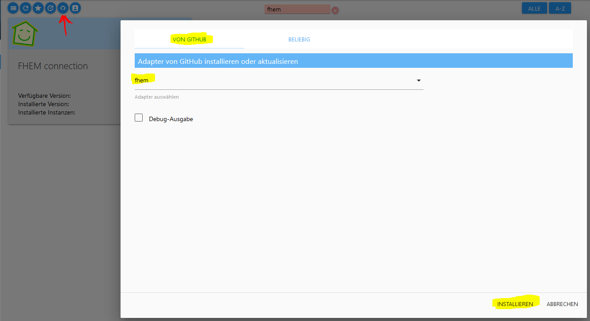  
*update_github*

#### In meiner ioBroker Installation werden nicht alle Module aus FHEM synchronisiert
Ist in FHEM ein Raum ioBroker vorhanden?

#### Objekte werden aus FHEM synchronisiert, danach aber nicht aktuallisiert
Eine Aktualisierung kann nur bei einem entsprechenden Event in FHEM erfolgen.
1. FHEM Event monitor auf Einträge prüfen
2. `fhem.0.info.Settings.logEventFHEM` auf true und in der Admin-Oberfläche Bereich `Log` werden alle über Telnet eingehenden Events angezeigt.

#### Abweichungen diese Doku zu meinem ioBroker System
Aktuellle Version von FHEM Adapters installiert?

<a name="beispiele"/>

## 9 Beispiele/Demo

<a name="beispiele_material"/>
 
### 9.1 Adapter Material UI

#### Motion / Bewegungsmelder

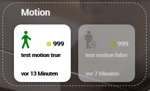  
*Ansicht Material UI*

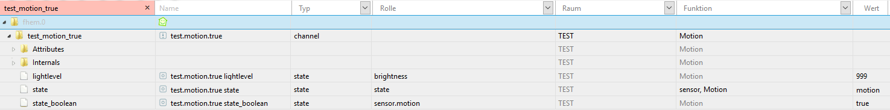  
*Objekte*

FHEM  | do |Rolle                |Art | Read | Write | min | max |
:----:|:----:|:-------------------|:--:|:---:|:------:|:---:|:---:|
OK    | use | sensor.motion       | Logikwert | true | x | x | x 
no    | or |state.motion          | Logikwert | true | x | x | x 
no     | opt | brightness         | Zahl | true |  x | x | x 

#### Door / Tür

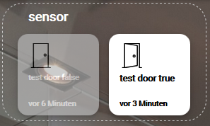  
*Ansicht Material UI*

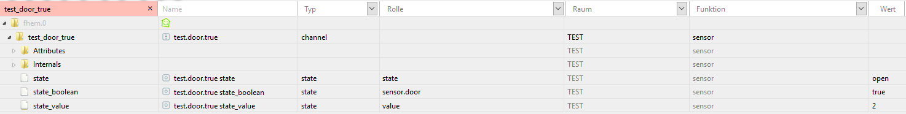  
*Objekte*

FHEM  | do |Rolle                |Art | Read | Write | min | max |
:----:|:----:|:-------------------|:--:|:---:|:------:|:---:|:---:|
OK    | use | sensor.door       | Logikwert | true | x | x | x 
no    | or |state.door          | Logikwert | true | x | x | x 

#### Window / Fenster

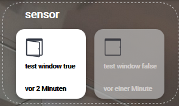  
*Ansicht Material UI*

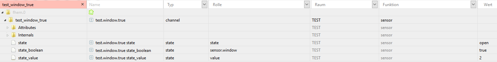  
*Objekte*

FHEM  | do |Rolle                |Art | Read | Write | min | max |
:----:|:----:|:-------------------|:--:|:---:|:------:|:---:|:---:|
OK    | use | sensor.window       | Logikwert | true | x | x | x 
no    | or |state.window          | Logikwert | true | x | x | x 

oder nummerisch offen=0;gekippt=1;zu=2

FHEM  | do |Rolle                |Art | Read | Write | min | max |
:----:|:----:|:-------------------|:--:|:---:|:------:|:---:|:---:|
no   | use | value.window       | Zahl | true | x | x | x 
no    | or |state.window  ?       | Zahl | true | x | x | x 

#### Thermostat / Heizung

  
*Ansicht Material UI*

  
*Objekte*

FHEM  | do |Rolle                |Art | Read | Write | min | max |
:----:|:----:|:-------------------|:--:|:---:|:------:|:---:|:---:|
OK    | use | level.temperature    | Zahl | true | true | x | x 
OK    | opt |value.temperature     | Zahl | true | x | x | x 
no    | opt | value.humidity       | Zahl | true | x | x | x 
no    | opt | switch.boost         | Zahl | true | x | x | x 

#### Temperature / Temperatur 

  
*Ansicht Material UI*

  
*Objekte*

FHEM  | do |Rolle                |Art | Read | Write | min | max |
:----:|:----:|:-------------------|:--:|:---:|:------:|:---:|:---:|
OK    | use | value.temperature       | Zahl | true | x | x | x 
no    | opt | value.humidity          | Zahl | true | x | x | x 

#### Blind / Rollladen

  
*Ansicht Material UI*

  
*Objekte*

FHEM  | do |Rolle                |Art | Read | Write | min | max |
:----:|:----:|:-------------------|:--:|:---:|:------:|:---:|:---:|
no    | use | level.blind          | Zahl | true | true | x | x 
no    | opt | value.blind          | Zahl | true | x | x | x 
no    | opt | button.stop          | Logikwert | true | true | x | x 
no    | or  | action.stop          | Logikwert | true | true | x | x 

#### Light / Licht
  
*Ansicht Material UI*

  
*Objekte*

FHEM  | do |Rolle                |Art | Read | Write | min | max |
:----:|:----:|:-------------------|:--:|:---:|:------:|:---:|:---:|
OK    | use | switch.light        | Logikwert | true | true | x | x 
no    | opt | switch.light           | Logikwert | true | false | x | x 

#### Dimmer 

  
*Ansicht Material UI*

  
*Objekte*

FHEM  | do |Rolle                |Art | Read | Write | min | max |
:----:|:----:|:-------------------|:--:|:---:|:------:|:---:|:---:|
OK    | use | level.dimmer         | Zahl | true | true | Zahl | Zahl 
no    | or  | level.brightness     | Zahl | true | true | Zahl | Zahl 
no    | opt | value.dimmer         | Zahl | true | x | x | x 
OK    | opt | switch.light         | Logikwert | true | true | x | x 
no    | opt | switch.light         | Logikwert | true | false | x | x 

#### Socket / Steckdose
  
*Ansicht Material UI*

  
*Objekte*

FHEM  | do |Rolle                |Art | Read | Write | min | max |
:----:|:----:|:-------------------|:--:|:---:|:------:|:---:|:---:|
OK    | use | switch                 | Logikwert | true | true | x | x 
no    | or  | switch.active          | Logikwert | true | true | x | x 
no    | or  | state                  | Logikwert | true | true | x | x 
no    | opt | state                  | Logikwert | true | false | x | x 
no    | opt | state.active           | Logikwert | true | false | x | x 

#### Volume / Lautstärke

  
*Ansicht Material UI*

  
*Objekte*

FHEM  | do |Rolle                |Art | Read | Write | min | max |
:----:|:----:|:-------------------|:--:|:---:|:------:|:---:|:---:|
OK    | use | level.volume          | Zahl | true | true | Zahl | Zahl 
OK    | opt | value.volume          | Zahl | true | x | Zahl | Zahl 
OK    | opt | media.mute            | Logikwert | true | true | x | x 

#### GroupVolume / Lautstärke Gruppe

  
*Ansicht Material UI*

  
*Objekte*

FHEM  | do |Rolle                |Art | Read | Write | min | max |
:----:|:----:|:-------------------|:--:|:---:|:------:|:---:|:---:|
OK    | use | level.volume.group         | Zahl | true | true | Zahl | Zahl 
OK    | opt | value.volume.group         | Zahl | true | x | Zahl | Zahl 
OK    | opt | media.mute.group           | Logikwert | true | true | x | x 

#### Mediaplayer 

  
*Ansicht Material UI*

  
*Objekte*

FHEM  | do |Rolle                |Art | Read | Write | min | max |
:----:|:----:|:-------------------|:--:|:---:|:------:|:---:|:---:|
OK    | use | media.state         | Logikwert | true | false | x | x 
no    | or  | media.state         | Zahl | true | false | x | x 
OK    | opt | button.play         | Logikwert | true | true | x | x 
no    | or  | action.play         | Logikwert | true | true | x | x 
OK    | opt | button.pause        | Logikwert | true | true | x | x 
no    | or  | action.pause        | Logikwert | true | true | x | x 
OK    | opt | button.stop         | Logikwert | true | true | x | x 
no    | or  | action.stop         | Logikwert | true | true | x | x 
OK    | opt | button.next         | Logikwert | true | true | x | x 
no    | or  | action.next         | Logikwert | true | true | x | x 
OK    | opt | button.prev         | Logikwert | true | true | x | x 
no    | or  | action.prev         | Logikwert | true | true | x | x 
OK    | opt | media.mode.shuffle  | Logikwert | true | true | x | x 
OK    | opt | media.mode.repeat   | Zahl | true | true | x | x 
no    | opt | media.artist        | Zeichenkette | true | false | x | x 
no    | opt | media.album         | Zeichenkette | true | false | x | x 
no    | opt | media.title         | Zeichenkette | true | false | x | x 
OK    | opt | media.cover         | Zeichenkette | true | false | x | x 
no    | or  | media.cover.big     | Zeichenkette | true | false | x | x 
no    | or  | media.cover ?       | Zeichenkette | true | false | x | x 
no    | opt | media.duration      | Zahl | true | false | x | x 
no    | opt | media.elapsed       | Zahl | true | false | x | x 
no    | opt | media.season        | Zahl | true | true | x | x 
no    | opt | media.seek          | Zahl | true | true | x | x 
no    | opt | media.track         | Zeichenkette | true | false | x | x 
no    | opt | media.episode       | Zeichenkette | true | false | x | x 
no    | opt | media.season        | Zeichenkette | true | false | x | x 
OK    | opt | level.volume        | Zahl | true | true | Zahl | Zahl 
no    | opt | level.volume        | Zahl | true | false | Zahl | Zahl 
OK    | opt | media.mute          | Logikwert | true | true | x | x

<a name="beispiele_vis"/>
 
### 9.2 Adapter VIS

<a name="deinstallation"/>

## 10 Deinstallation
sollte die Instanz wieder entfernt werden sollen wird diese über das zugeordnete Mülleimer-Icon
in der Rubrik Instanzen entfernt

Es erscheint eine Sicherheitsabfrage, die mit ***OK*** bestätigt werden muss

Anschließend erscheint wieder ein Fenster, dass die Abarbeitung der Deinstallationsbefehle zeigt

Bei dieser Deinstallation werden alle zu der Instanz gehörenden Objekte vollständig entfernt.

Sollten die Installationsdateien vollständig von dem Host gelöscht werden, muss dies über das Mülleimer-Icon
in der Kachel des AdapterName-Adapters in der Rubrik Adapter geschehen.

<a name="links"/>

## 11 Links

FHEM-Adapter
* ioBroker Forum / FHEM Adapter https://forum.iobroker.net/viewtopic.php?f=20&t=5387&start=200
* ioBroker-Tutorial Part 9: Verknüpfung mit FHEM | haus-automatisierung.com https://youtu.be/6jwlxGqt5TU

ioBroker VIS
* smarthome-tricks.de / Tutorial VIS Widgets https://www.smarthome-tricks.de/iobroker-vis-widgets/

Tools
* Download Putty https://www.putty.org/

FHEM
* FHEMs Einstiegsseite https://fhem.de/fhem_DE.html
* FHEM Forum           https://forum.fhem.de/

## 12 Entwicklerbereich
* github ioBroker.fhem https://github.com/ioBroker/ioBroker.fhem

<a name=historie/> 

## 13 Historie

