# &emsp;FHEM-Adapter  Auswahl Device(s) aus FHEM zur Synchronisation in ioBroker
Nach dem Start des FHEM Adapter und erfolgreichem Verbindungsaufbau über Telnet wird der Befehl 'jsonlist2' abgesetzt.
Dadurch können für jedes Device aus FHEM alle Daten ausgelsen werden. Verwendet werden PossibleSets, Internals, Readings und Attributes. 

Hier ein Beispiel für die Ausgabe von 'jsonlist2 switch00'
 *jsonlist2 switch00*

Nach der Anlage einer neuen Instanz für den FHEM Adapter und Start des Adapters werden somit alle Devices aus FHEM übertragen und die jeweiligen Objekte im ioBroker angelegt.

Der FHEM Adpater bringt jedoch schon eine Möglichkeit zur Einschränkung der zu übertragenen Devices mit.
Durch die Verwendung von room ioBroker oder/und room IOB_OUT in FHEM werden nur Device(s) aus diesem Raum/Räume übertragen.
Da es die Funktion schon länger gibt wird sie heute wohl in den meisten Fällen genutzt.

Nachteil: In FHEM müssen die zur Übertragung gewünschten Devices dem Raum ioBroker/IOB_Out zugeordnet werden.

Zusätzlich werden beim 1. Start des FHEM Adapter unter fhem.x.info.Configurations noch weitere Objekte angelegt.
Mit diesen Objekten ist es möglich die Auswahl der Devices für den Übertrag flexibel zu definieren.

### Zusätzliche Objekte unter fhem.x.info.Configurations sind:
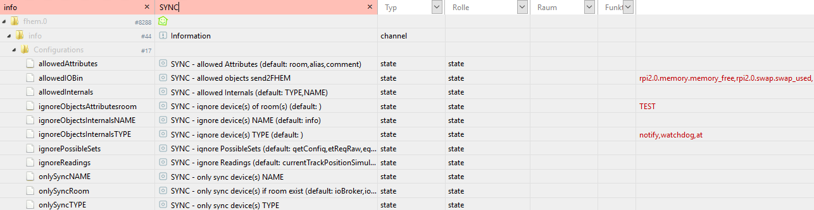 *Configuration SYNC*

#### fhem.0.info.Configurations.onlySyncRoom
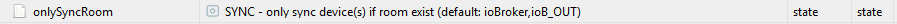 *onlySyncRoom*

default:   ioBroker, IOB_OUT
jsonlist2: [Attributes] room

Durch Eingabe Raum oder mehere Räume (durch Komma getrennt) aus FHEM werden nur noch Devices aud diesen Räumen  übertragen.

#### fhem.0.info.Configurations.onlySyncTYPE
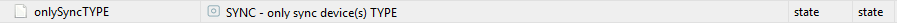 *onlySyncTYPE*

default:    -
jsonlist2: [Internals] TYPE

Durch Eingabe TYPE (zB dummy) oder mehere TYPE´s (durch Komma getrennt) werden nur noch Devices für diesen TYPE übertragen.
Praktisch wenn nur bestimmte Devices zb SONOSPLAYER zur Übertragung gewünscht sind.

#### fhem.0.info.Configurations.onlySyncNAME
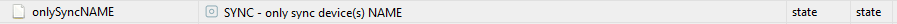 *onlySyncNAME*

default: -
jsonlist2: [Internals] NAME

Durch Eingabe NAME (wie hier im Bsp switch00) oder mehere Namen (durch Komma getrennt) werden nur noch diese Devices übertragen.

#### fhem.0.info.Configurations.ignoreObjectsAttributesroom
 *ignoreObjectsAttributesroom*

default:   -
jsonlist2: [Attributes] room

Durch Eingabe Raum oder mehere Räume (durch Komma getrennt) aus FHEM werden die Devices aud diesen Räumen NICHT  übertragen.

#### fhem.0.info.Configurations.ignoreObjectsInternalsTYPE
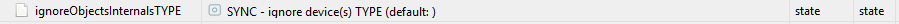 *ignoreObjectsInternalsTYPE*

default:    -
jsonlist2: [Internals] TYPE

Durch Eingabe TYPE (zB dummy) oder mehere TYPE´s (durch Komma getrennt) werden die Devices für diesen TYPE NICHT übertragen.
Praktisch zb für TYPE = notify, at usw die im ioBroker gar nicht benötigt werden.

#### fhem.0.info.Configurations.ignoreObjectsInternalsNAME
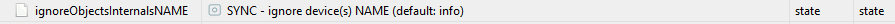 *ignoreObjectsInternalsNAME*

default:    info
jsonlist2: [Internals] NAME

Durch Eingabe NAME (wie hier im Bsp switch00) oder mehere Namen (durch Komma getrennt) werden die Devices NICHT übertragen.

#### fhem.0.info.Configurations.ignorePossibleSets
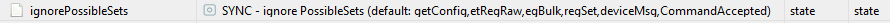 *ignorePossibleSets*

default: getConfig, etRegRaw, egBulk, regSet, deviceMsg, CommandAccepted
jsonlist2: [PossibleSets]

Hier eingetragene PossibleSets (durch Komma getrennt) werden NICHT übertragen.

#### fhem.0.info.Configurations.ignoreReadings
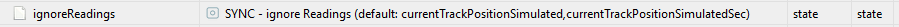 *ignoreReadings*

default:    currentTrackPositionSimulated, currentTrackPositionSimulatedSec
jsonlist2: [Readings]

Hier eingetragene Readings (durch Komma getrennt) werden NICHT übertragen.

#### fhem.0.info.Configurations.allowedInternals
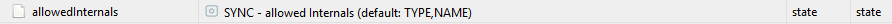 *allowedInternals*

default: TYPE, NAME
jsonlist2: [Internals]

Durch Eingabe weiterer Werte aus Internals werden diese auch übertragen.
Übertrag kann jedoch nur einmalig beim Start FHEM Adapter erfolgen!

Anzeige unter dem jeweiligen Objekt/Device 

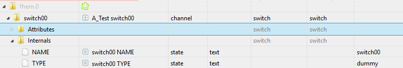 *allowedInternals*

#### fhem.0.info.Configurations.allowedAttributes
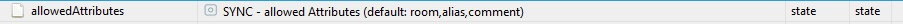 *allowedAttributes*

default:   room, alias, comment
jsonlist2: [Attributes]

Durch Eingabe weiterer Werte aus Attributes werden diese auch übertragen.
DIe jeweiligen Attributes können somit auch im ioBroker geändert werden!

Anzeige unter dem jeweiligen Objekt/Device 

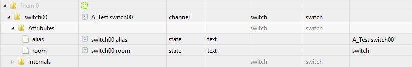 *allowedAttributes*

#### fhem.0.info.Configurations.allowedIOBin
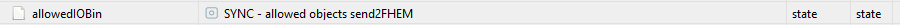 *allowedIOBin*

default: -

Definition zum Übertrag state(s) aus ioBroker in FHEM

Durch Eingabe state aus IoBroker oder mehere state's (durch Komma getrennt) werden diese nach FHEM in den Raum ioB_IN übertragen und könne somit auch in FHEM verwendet werden.
Bsp: state ioBroker alexa2.0.Echo-Devices.xyz.Commands.speak mit Wert "Hello world" 
wird in FHEM im Raum ioB_IN als dummy alexa2.0.Echo-Devices.xyz.Commands.speak mit state "Hello world" angelegt.

Statt einem kompletten state Name kann zB auch nur alexa2.0 verwendet werden.
Damit werden alle states die mit alexa2.0 beginnen nach FHEM übertragen.

<!-- Bild einfügen
 *jsonlist2 switch00*
-->
-

